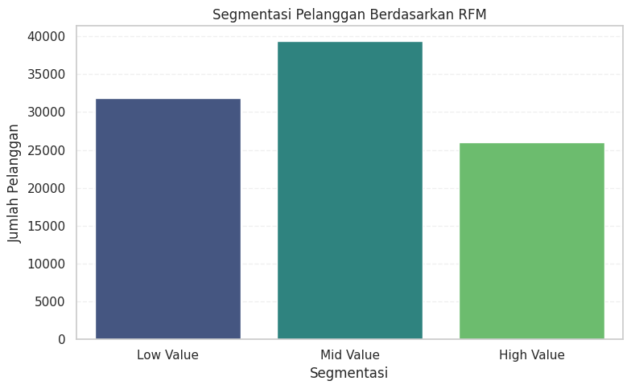

# Proyek Analisis Data: E-Commerce Behavior & Loyalty Dashboard


---

## Deskripsi Proyek

Proyek ini bertujuan untuk menganalisis perilaku pelanggan berdasarkan dataset e-commerce publik. Fokus utamanya adalah mengidentifikasi pola pembelian, loyalitas pelanggan, dan performa kategori produk menggunakan teknik eksplorasi data dan visualisasi interaktif berbasis **Streamlit**.

Proyek ini disusun dalam rangka **DBS Coding Camp 2025**.

---

## Struktur Folder

```
?? Proyek Analisis Data
+-- data/                  # Dataset CSV mentah
+-- dashboard/             # Aplikasi dashboard Streamlit
+-- notebook.ipynb         # Notebook eksplorasi & visualisasi
+-- requirements.txt       # Library yang diperlukan
+-- url.txt                # Link deploy (jika tersedia)
+-- README.md              # Dokumentasi proyek ini
```

---

## Cara Menjalankan Project

### 1. Kloning Repository

```bash
git clone https://github.com/sulthonkaf/dbs-codingcamp-2025.git
cd dbs-codingcamp-2025
```

### 2. Install Dependencies

```bash
pip install -r requirements.txt
```

## Dataset

Dataset digunakan dari file ZIP yang disimpan di Google Drive:  
🔗 [Unduh Manual](https://drive.usercontent.google.com/download?id=1nqjOKZHixgbfX9sBmAa3DxWCpFrsudqk&authuser=0)

Atau digunakan langsung di kode dengan `requests.get(...)` dan link berikut:

[Download Dataset](https://drive.usercontent.google.com/download?id=1nqjOKZHixgbfX9sBmAa3DxWCpFrsudqk&authuser=0)

**Isi ZIP meliputi:**

- `orders_dataset.csv`
- `order_reviews_dataset.csv`
- `products_dataset.csv`
- `product_category_name_translation.csv`
- `geolocation_dataset.csv`

---

## 🔍 Insight & Temuan Awal

| Kategori        | Insight Final                                                                                                                                               |
|----------------|---------------------------------------------------------------------------------------------------------------------------------------------------------------|
| **Produk**      | Produk paling sering dibeli adalah `aca2eb7d00ea1a7b8ebd4e68314663af` dari kategori **furniture_decor** dengan total **536 pembelian**. Top 3 kategori dominan: *garden_tools*, *bed_bath_table*, *computers_accessories*. |
| **Pelanggan**   | Segmentasi RFM menunjukkan mayoritas pelanggan berada di segmen **Mid Value**, diikuti **Low Value**, dan terakhir **High Value**. Ini menunjukkan potensi besar untuk meningkatkan loyalitas pelanggan menengah. |
| **Waktu Order** | Hari dengan transaksi terbanyak adalah **Senin–Selasa**, dan bulan dengan volume tertinggi adalah **Agustus**, dengan total **12.575 pesanan**. Aktivitas belanja paling rendah terjadi pada akhir pekan. |

### Ilustrasi Segmentasi Pelanggan



### 3. Jalankan Dashboard

```bash
streamlit run dashboard/dashboard.py
```

---

## Tools & Teknologi

- **Python**
- **Pandas**, **NumPy**
- **Matplotlib**, **Seaborn**
- **Streamlit** untuk dashboard interaktif
- **Jupyter Notebook** untuk eksplorasi awal

---

## Tujuan Pembelajaran

- Mengasah kemampuan **EDA (Exploratory Data Analysis)**
- Memahami **pola perilaku konsumen**
- Membuat **visualisasi interaktif** berbasis web
- Menyampaikan insight dalam bentuk dashboard yang **mudah dipahami oleh stakeholder**

---

## Author

**Sulthon Kaffaah Al Farizzi**  
Informatika, Universitas Muhammadiyah Surakarta  
GitHub: [@sulthonkaf](https://github.com/sulthonkaf)

---

## Lisensi

Project ini dilindungi oleh [MIT License](LICENSE).
